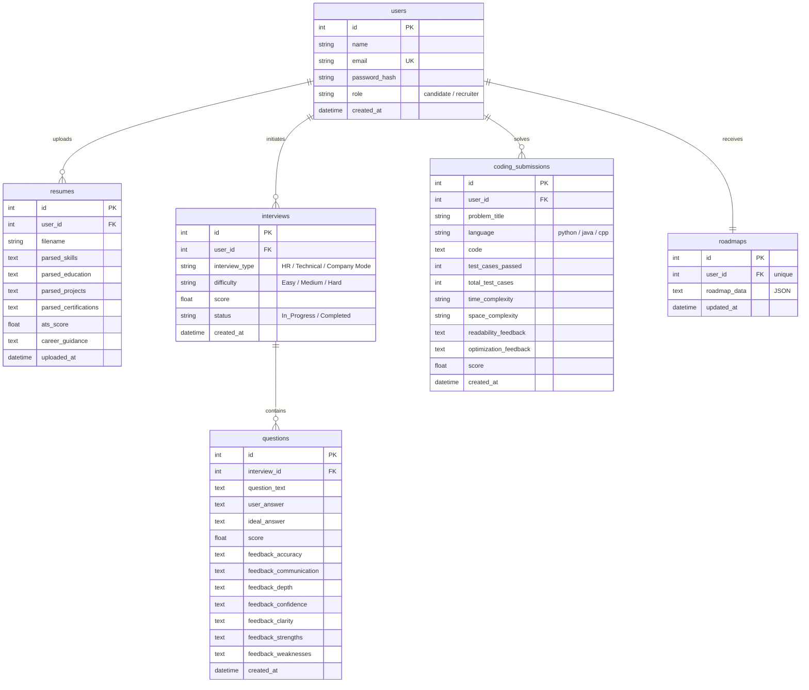

# InterviewAce – AI Interview Preparation Assistant

InterviewAce is a production-quality, AI-powered interview preparation assistant designed for college students and job seekers. The platform simulates real HR and technical mock interviews, evaluates verbal answers, verifies resumes for ATS scoring, compiles and sandbox-tests candidate code submissions, suggests personalized learning roadmaps, and provides recruiters with comparative applicant dashboards.

## Folder Structure

```text
interview-ace/
├── backend/
│   ├── app/
│   │   ├── main.py              # FastAPI app initializer
│   │   ├── config.py            # Environment configurations
│   │   ├── database.py          # Database session and setup
│   │   ├── models.py            # DB Schema Models
│   │   ├── schemas.py           # Pydantic validation schemas
│   │   ├── security.py          # Hashing & JWT validation
│   │   ├── routers/             # Controller endpoints
│   │   └── services/            # Subprocess executor & Gemini API service
│   ├── seed_data.py             # Mock data database seeder
│   └── requirements.txt         # Backend python package configurations
└── frontend/
    ├── src/
    │   ├── main.jsx             # React DOM entrypoint
    │   ├── App.jsx              # Main routing grid
    │   ├── index.css            # Tailwind directive styles
    │   ├── components/          # Reusable Navbar widget
    │   ├── context/             # JWT auth state context
    │   ├── pages/               # Landing, Dashboards, Simulator pages
    │   └── utils/               # Axios/Fetch API wrapper
    ├── index.html               # Main template page
    └── package.json             # NPM node packaging dependencies
```

---

## Entity-Relationship (ER) Diagram

The system database schemas are designed around relational integrity, using SQLAlchemy ORM:



---

## API Documentation

### 1. Authentication Router (`/api/auth`)
- **POST `/register`**: Create standard candidate/recruiter account.
- **POST `/login`**: Exchange email/password for a signed JWT access token.
- **GET `/me`**: Return verified profile info.

### 2. Resume Router (`/api/resume`)
- **POST `/upload`**: Accepts PDF resume upload, extracts text selectables, returns parsed skills, education, ATS scoring metrics.
- **GET `/my-resume`**: Returns user's latest analyzed resume profile.

### 3. Interview Router (`/api/interview`)
- **POST `/start`**: Request custom technical, behavioral (HR), or company-specific (Google/Amazon/TCS etc.) questions at specified difficulty (Easy/Medium/Hard).
- **POST `/{id}/submit`**: Post candidate answers for evaluation. Returns accuracy scores (out of 10), strengths, and communication tips.
- **GET `/{id}`**: Revisit a completed mock interview session feedback.

### 4. Coding Sandbox Router (`/api/coding`)
- **GET `/problems`**: Returns LeetCode questions (Two Sum, Palindrome Number, Valid Parentheses) and languages templates.
- **POST `/submit`**: Submits user code for sandbox execution against test parameters and triggers AI critiques.

### 5. Analytics Router (`/api/analytics`)
- **GET `/dashboard`**: Returns averages, weekly progress matrices, and strengths lists.
- **GET `/history`**: Returns chronological lists of all completed mocks.
- **GET `/roadmap`**: Returns personalized 4-week placement preparation study roadmap.
- **POST `/roadmap/regenerate`**: Recompiles targets and creates a new study roadmap.

### 6. Recruiter Router (`/api/recruiter`)
- **GET `/candidates`**: Returns registered candidate listings with their ATS and mock interview score averages.
- **GET `/candidates/compare`**: Compiles technical comparisons and hiring recommendations across applicants.

---

## Running Locally

### Backend Setup
1. Change directory to the backend folder:
   ```bash
   cd backend
   ```
2. Set up virtual environment and install packages:
   ```bash
   python3 -m venv venv
   source venv/bin/activate
   pip install -r requirements.txt
   ```
3. Run the database mock data seeder:
   ```bash
   python seed_data.py
   ```
4. Start the FastAPI development server:
   ```bash
   uvicorn app.main:app --reload
   ```

### Frontend Setup
1. Open another shell session and change directory to the frontend:
   ```bash
   cd frontend
   ```
2. Install npm dependencies:
   ```bash
   npm install
   ```
3. Run Vite server:
   ```bash
   npm run dev
   ```
4. Access platform on web: http://localhost:5173

### Default Test Login Credentials
- **Candidate Portal**:
  - Email: `candidate@interviewace.com`
  - Password: `password123`
- **Recruiter Portal**:
  - Email: `recruiter@interviewace.com`
  - Password: `password123`
